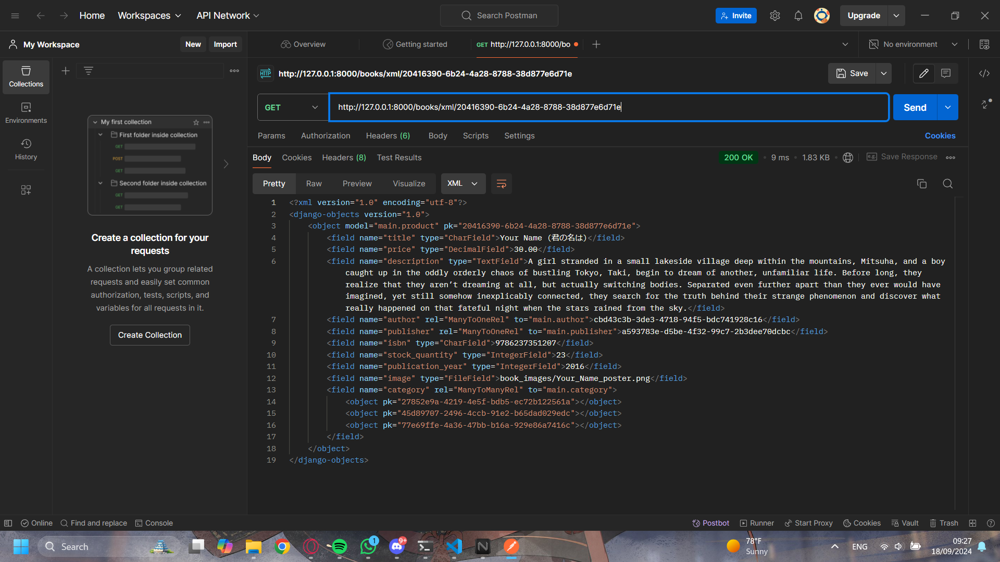
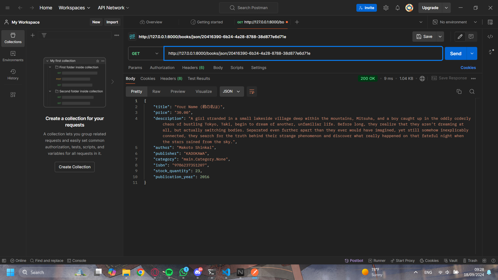

# README

Aplikasi Django yang telah di-deploy dapat diakses melalui tautan berikut:
[Link ke Aplikasi PWS](http://rahardi-salim-tugasbookstore.pbp.cs.ui.ac.id)

# TUGAS 2

## 1. Cara Implementasi Checklist

1. **Membuat Proyek Django Baru**
     ```bash
     django-admin startproject book_store
     ```

2. **Membuat Aplikasi dengan Nama `main`**
   - Masuk ke direktori proyek:
     ```bash
     cd book_store
     ```
   - Membuat aplikasi baru dengan nama `main`:
     ```bash
     python manage.py startapp main
     ```

3. **Melakukan Routing pada Proyek**
   - Menambahkan aplikasi `main` ke dalam `INSTALLED_APPS` di `settings.py`:
     ```python
     INSTALLED_APPS = [
        ...
         'main',
     ]
     ```
   - Menambahkan routing di `urls.py` proyek:
     ```python
     from django.contrib import admin
     from django.urls import path, include

     urlpatterns = [
         path('admin/', admin.site.urls),
         path('', include('main.urls')),
     ]
     ```

4. **Membuat Model `Product`**
   - Di dalam `models.py` aplikasi `main`, buat model `Product` dengan atribut yang disebutkan:
     ```python
     from django.db import models
     class Product(models.Model):
        title = models.CharField(max_length=255)
        price = models.FloatField()
        description = models.TextField()

        # Additional Attributes
        author = models.CharField(max_length=255)
        publication_year = models.IntegerField()
        condition = models.CharField(max_length=50)
        image = models.ImageField(upload_to='book_images/', blank=True, null=True)

        def __str__(self):
            return self.title
     ```

5. **Membuat Fungsi di `views.py`**
   - Di `views.py` aplikasi `main`, buat fungsi yang mengembalikan template HTML:
     ```python
     from django.shortcuts import render
     from .models import Product as Book

     def show_main(request):
        books = Book.objects.all()

        context = {
            'books': books,
        }

        return render(request, "main.html", context)
     ```

6. **Membuat Routing di `urls.py` Aplikasi `main`**
   - Membuat file `urls.py` di dalam aplikasi `main` dan tambahkan routing:
     ```python
     from django.urls import path
     from main.views import show_main

     app_name = 'bookstore'

     urlpatterns = [
        path('', show_main, name='show_main'),
     ]
     ```

7. **Melakukan Deployment ke PWS**
   - **Buat akun dan login** di [PWS](https://pbp.cs.ui.ac.id).
   - **Buat proyek baru (tugasbookstore)** di halaman PWS, lalu simpan **Project Credentials**.
   - Tambahkan URL deployment PWS ke `ALLOWED_HOSTS` di `settings.py`:
     ```python
     ALLOWED_HOSTS = ["localhost", "127.0.0.1", "rahardi-salim-tugasbookstore.pbp.cs.ui.ac.id"]
     ```
   - Lakukan `git add`, `commit`, dan `push` perubahan ke GitHub.
   - Jalankan **Project Command** dari PWS, lalu jalankan:
     ```bash
     git remote add pws https://pbp.cs.ui.ac.id/rahardi.salim/tugasbookstore
     git branch -M master
     git push pws master
     ```
   - **Cek status deployment** di PWS, jika "Running," akses URL PWS.
   - Untuk update selanjutnya, cukup jalankan:
     ```bash
     git push pws main:master
     ```

## 2. Bagan dan Penjelasan Alur Request-Response

Client Request 
    | 
    v 
urls.py
    | 
    v 
views.py
    | 
    v 
models.py  
    | 
    v 
Template HTML
    | 
    v 
Client Response

**Penjelasan:**

- **`urls.py`**: File ini bertanggung jawab untuk mengatur routing URL. Ini menentukan URL mana yang akan memicu fungsi tertentu di views.py. Biasanya, menggunakan path atau re_path untuk menghubungkan URL ke view yang relevan.
- **`views.py`**: Di sini logika aplikasi diproses. Ketika sebuah request diterima, views.py akan mengambil data yang dibutuhkan (dari database melalui model, jika perlu) dan mengirimkannya ke template HTML atau mengembalikan response secara langsung.
- **`models.py`**: File ini digunakan untuk mendefinisikan model yang merepresentasikan struktur data dan skema database. Models berinteraksi dengan database untuk query, insert, update, atau delete data. Jika views.py membutuhkan data dari database, akan diakses melalui models.
- **`Template HTML`**: Template adalah tempat untuk merender data yang dipersiapkan di views.py. Dengan menggunakan template engine seperti Django template language (DTL), data dari views.py dapat ditampilkan ke pengguna dalam bentuk HTML.

## 3. Fungsi Git dalam pengembangan perangkat lunak

**Fungsi Git**: Git adalah sistem kontrol versi terdistribusi yang sangat populer dalam pengembangan perangkat lunak. Fungsinya adalah untuk memudahkan pengembang dalam mengelola perubahan kode dari waktu ke waktu, melacak siapa yang melakukan perubahan, dan memastikan bahwa semua kolaborator memiliki versi kode yang sama. Beberapa fungsi utama Git meliputi:

- **Manajemen Versi**: Git memungkinkan pengembang untuk menyimpan beberapa versi dari proyek mereka. Jika terjadi kesalahan dalam pengembangan, mereka dapat dengan mudah kembali ke versi sebelumnya tanpa kehilangan kemajuan.
- **Kolaborasi**: Git mendukung kolaborasi tim secara efektif. Pengembang dapat bekerja pada fitur yang berbeda secara bersamaan dan kemudian menggabungkannya menggunakan mekanisme branching dan merging.
- **Riwayat Perubahan**: Git menyimpan semua perubahan yang terjadi pada proyek, sehingga memungkinkan pengembang untuk melacak dan memeriksa apa yang telah diubah, kapan, dan oleh siapa. Ini sangat penting untuk menemukan dan memperbaiki bug atau konflik dalam kode.
- **Branching dan Merging**: Fitur branching memungkinkan pengembang untuk mengerjakan fitur atau perbaikan bug secara independen dari kode utama (main/master). Setelah selesai, perubahan dapat digabungkan kembali (merged) ke branch utama tanpa mengganggu alur kerja lainnya.
- **Distributed Version Control**: Setiap pengembang memiliki salinan penuh dari seluruh riwayat proyek, yang memungkinkan mereka bekerja secara offline dan kemudian melakukan sinkronisasi dengan repositori utama ketika kembali online.

## 4. Mengapa framework Django dijadikan permulaan pembelajaran pengembangan perangkat lunak?

Django dijadikan framework awal untuk pembelajaran pengembangan perangkat lunak karena memiliki banyak fitur bawaan ("batteries-included") yang memudahkan pemula memahami berbagai aspek pengembangan web, seperti routing, autentikasi, dan keamanan. Django juga mendorong prinsip DRY (Don't Repeat Yourself), yang mengajarkan pengembangan kode yang efisien dan terstruktur. Selain itu, Django memiliki dokumentasi yang lengkap serta komunitas yang besar, sehingga memudahkan pemula untuk belajar dan mendapatkan bantuan ketika dibutuhkan.

## 5. Mengapa model pada Django disebut sebagai ORM?

Django ORM (Object-Relational Mapper) mengabstraksikan interaksi dengan database menjadi objek Python, sehingga pengembang dapat melakukan operasi database tanpa menulis SQL. ORM ini mendukung berbagai database dan memungkinkan pengelolaan relasi antar model dengan mudah, serta otomatisasi validasi dan migrasi data.

# TUGAS 3

## 1. Jelaskan mengapa kita memerlukan data delivery dalam pengimplementasian sebuah platform?

Data delivery sangat penting dalam pengimplementasian sebuah platform karena memungkinkan transfer data antara server dan klien secara efisien. Tanpa data delivery, sebuah platform tidak akan mampu menyediakan informasi dinamis atau interaktif kepada pengguna. Data delivery mencakup pengiriman data dari server ke klien (seperti tampilan halaman web) maupun dari klien ke server (seperti form submission). Implementasi ini penting untuk berbagai jenis aplikasi yang membutuhkan interaksi real-time, personalisasi, dan validasi data secara langsung. Data delivery juga memastikan bahwa pengguna dapat berkomunikasi dengan platform secara efektif, memungkinkan fungsionalitas yang lebih interaktif dan dinamis, misalnya dalam aplikasi e-commerce, platform media sosial, atau layanan SaaS.

## 2. Menurutmu, mana yang lebih baik antara XML dan JSON? Mengapa JSON lebih populer dibandingkan XML?
Secara umum, JSON (JavaScript Object Notation) dianggap lebih baik dibandingkan XML (Extensible Markup Language) dalam konteks pengiriman data pada web modern. Hal ini karena beberapa alasan:

Simplicity (Kesederhanaan): JSON lebih sederhana dan mudah dibaca dibandingkan XML. JSON memiliki sintaks yang lebih ringkas karena tidak memerlukan tag pembuka dan penutup seperti XML.

Effisiensi: JSON menghasilkan ukuran data yang lebih kecil dibandingkan XML, sehingga lebih cepat untuk di-parse dan ditransfer di jaringan.

Native Support: JSON didukung secara native oleh banyak bahasa pemrograman, terutama JavaScript, yang membuatnya mudah digunakan dalam aplikasi web modern. Sementara XML memerlukan parsing yang lebih kompleks.

Struktur Data: JSON mendukung struktur data seperti array dan objek dengan lebih natural, sedangkan XML lebih berfokus pada struktur dokumen hierarkis.

JSON lebih populer dibandingkan XML karena faktor kesederhanaan, kecepatan, dan dukungan yang luas dalam pengembangan aplikasi web. Sebagian besar API modern menggunakan JSON karena kemudahan integrasinya dengan framework front-end.

## 3. Jelaskan fungsi dari method is_valid() pada form Django dan mengapa kita membutuhkan method tersebut?
Method is_valid() pada form Django digunakan untuk memeriksa apakah data yang di-submit melalui form memenuhi syarat validasi yang telah didefinisikan. Method ini melakukan dua hal penting:

Validasi data: Django memeriksa setiap field dalam form berdasarkan aturan validasi yang ditentukan di model atau form itu sendiri, misalnya apakah field yang diisi sesuai dengan tipe data yang diharapkan.

Membersihkan data: Jika validasi berhasil, method ini juga akan membersihkan data yang dimasukkan, mengubahnya ke format yang dapat digunakan lebih lanjut dalam aplikasi.

Kita membutuhkan method ini untuk memastikan bahwa data yang dikirim oleh pengguna valid sebelum diproses lebih lanjut (misalnya disimpan ke database). Jika method ini tidak digunakan, aplikasi bisa mengalami masalah seperti crash akibat data yang tidak sesuai, atau lebih buruk lagi, menerima input yang bisa membahayakan keamanan sistem.

## 4. Mengapa kita membutuhkan csrf_token saat membuat form di Django? Apa yang dapat terjadi jika kita tidak menambahkan csrf_token pada form Django? Bagaimana hal tersebut dapat dimanfaatkan oleh penyerang?
csrf_token (Cross-Site Request Forgery token) adalah token keamanan yang digunakan untuk melindungi aplikasi dari serangan CSRF. CSRF adalah jenis serangan di mana seorang penyerang mencoba mengirimkan permintaan palsu atas nama pengguna yang sudah terautentikasi, tanpa sepengetahuan pengguna.

Jika kita tidak menambahkan csrf_token pada form, maka aplikasi Django menjadi rentan terhadap serangan ini. Penyerang dapat memanfaatkan sesi aktif pengguna dan mengirimkan permintaan berbahaya (misalnya, transfer dana atau perubahan pengaturan akun) tanpa persetujuan pengguna.

Dengan menambahkan csrf_token, server akan memverifikasi bahwa permintaan tersebut benar-benar berasal dari form yang dibuat oleh aplikasi, sehingga serangan semacam ini dapat dicegah.

## 5. Jelaskan bagaimana cara kamu mengimplementasikan checklist di atas secara step-by-step (bukan hanya sekadar mengikuti tutorial).

### 5.1 Membuat Input Form untuk Menambahkan Objek Model:
- Saya membuat form untuk setiap model yang ada (Author, Publisher, Category, Product(Book), Customer, Order, OrderItem, Review) dan memasukan field field apa saja yang perlu di input pada forms.py .
- Saya membuat views baru seperti create_author, create_publisher, dan lainnya, yang menggunakan form ini untuk menangani input dari pengguna. Jika form valid, data akan disimpan ke database, dan pengguna akan diarahkan ke halaman yang sesuai (seperti author_list).
- Setiap view dihubungkan dengan template HTML sederhana yang menampilkan form untuk memasukkan data.

### 5.2 Menambahkan 4 Fungsi Views untuk Menampilkan Objek dalam Format XML dan JSON:

- Saya menambahkan 4 views baru: dua untuk menampilkan semua objek dalam format JSON dan XML (book_list_json, book_list_xml), dan dua lainnya untuk menampilkan objek spesifik berdasarkan ID dalam format JSON dan XML (book_detail_json, book_detail_xml).
- Untuk JSON, saya menggunakan JsonResponse untuk mengonversi queryset menjadi JSON. Sedangkan untuk XML, saya menggunakan Django's serializers.serialize() untuk mengonversi queryset menjadi XML.
- Pada view book_detail_json dan book_detail_xml, saya memanfaatkan get_object_or_404() untuk mengambil objek berdasarkan ID, dan kemudian menampilkan data dalam format yang sesuai.

### 5.3 Membuat Routing URL untuk Masing-masing Views:

- Saya menambahkan routing untuk setiap view yang telah dibuat ke dalam urls.py. Contohnya, untuk JSON dan XML, saya membuat route /books/json/ dan /books/xml/ untuk menampilkan semua data buku, serta /books/json/<uuid:id>/ dan /books/xml/<uuid:id>/ untuk menampilkan data buku berdasarkan ID. URL ini memastikan bahwa setiap permintaan yang masuk dapat diarahkan ke view yang sesuai, baik untuk form input maupun untuk menampilkan data dalam format yang diminta.

## POSTMAN LINK

[]()
[]()
[]()
[]()
