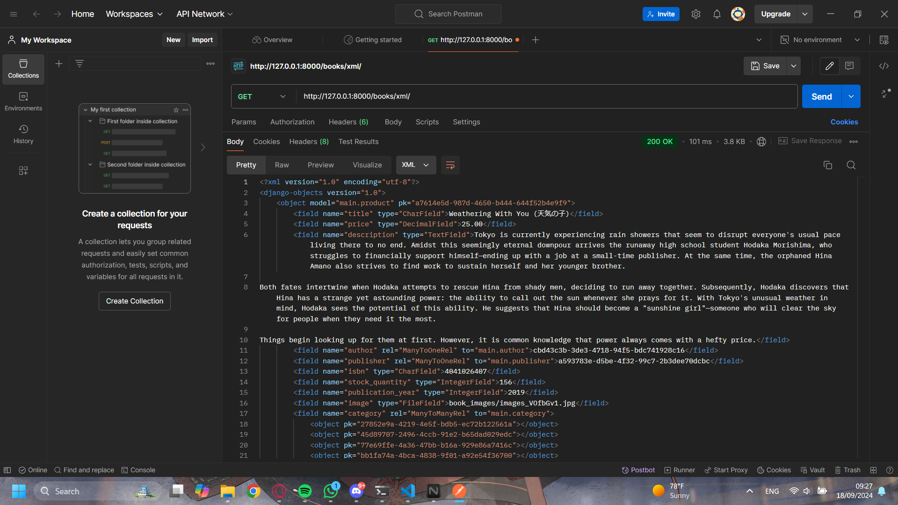
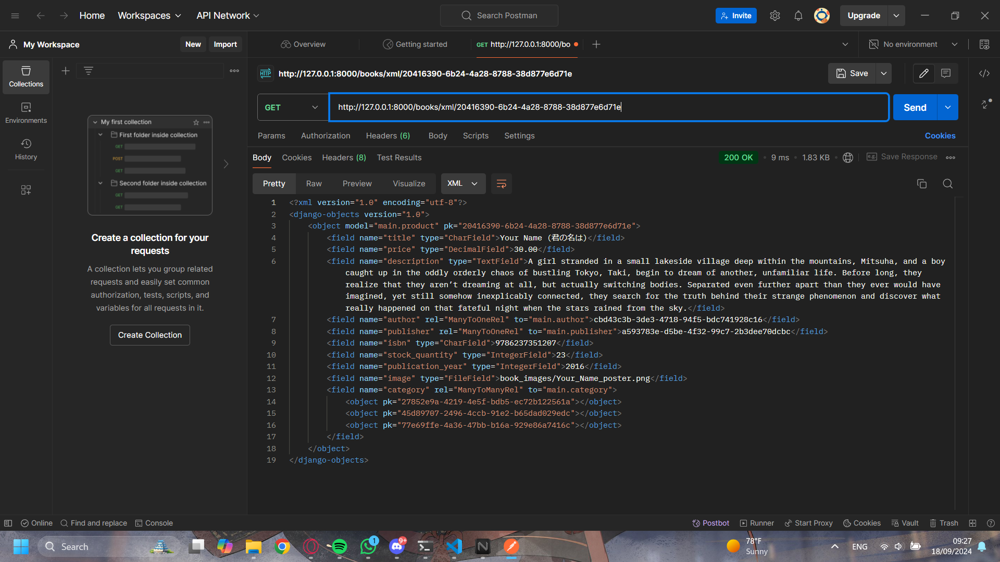
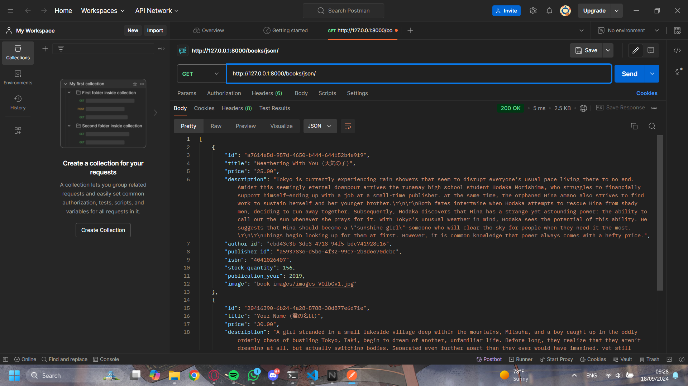
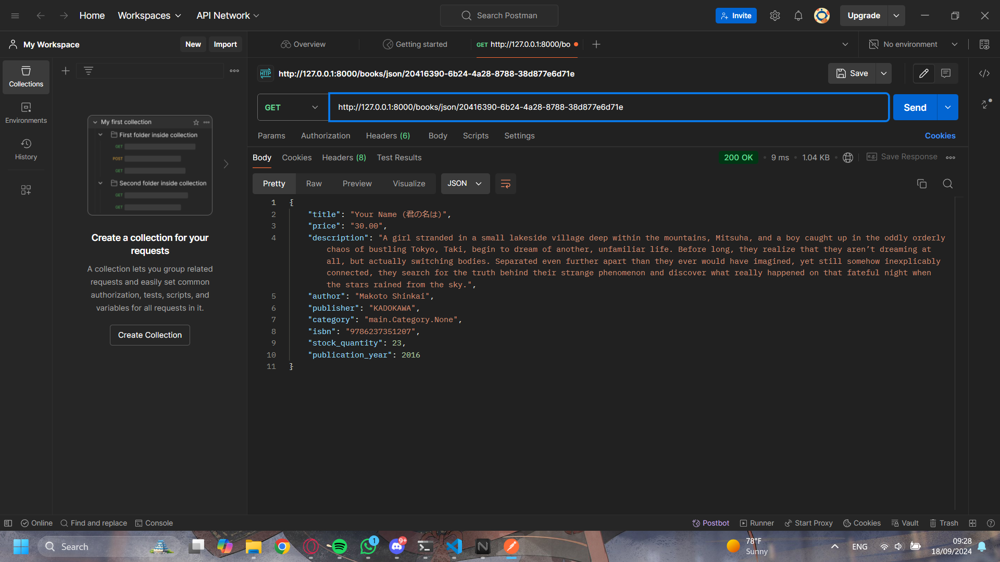
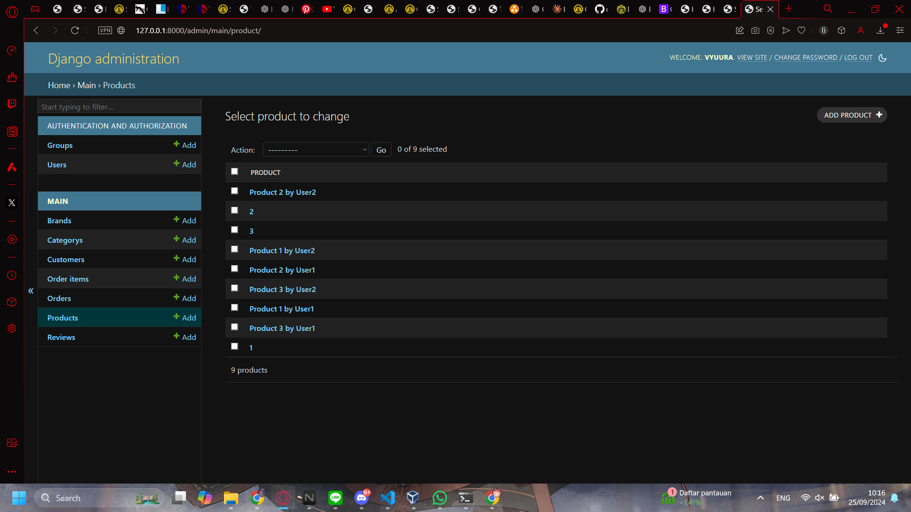
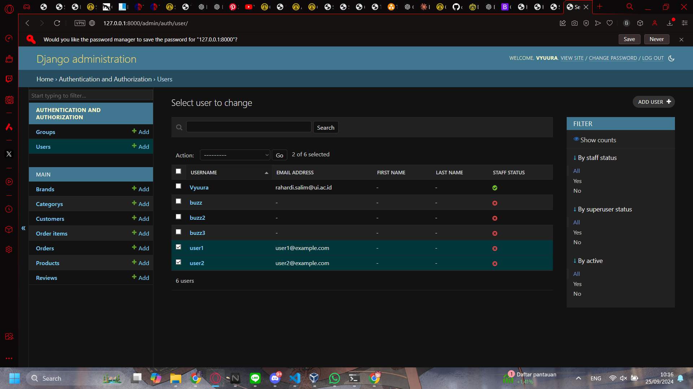

# README

Aplikasi Django yang telah di-deploy dapat diakses melalui tautan berikut:
[Link ke Aplikasi PWS](http://rahardi-salim-tugasbookstore.pbp.cs.ui.ac.id)

# TUGAS 2

## 1. Cara Implementasi Checklist

1. **Membuat Proyek Django Baru**
     ```bash
     django-admin startproject book_store
     ```

2. **Membuat Aplikasi dengan Nama `main`**
   - Masuk ke direktori proyek:
     ```bash
     cd book_store
     ```
   - Membuat aplikasi baru dengan nama `main`:
     ```bash
     python manage.py startapp main
     ```

3. **Melakukan Routing pada Proyek**
   - Menambahkan aplikasi `main` ke dalam `INSTALLED_APPS` di `settings.py`:
     ```python
     INSTALLED_APPS = [
        ...
         'main',
     ]
     ```
   - Menambahkan routing di `urls.py` proyek:
     ```python
     from django.contrib import admin
     from django.urls import path, include

     urlpatterns = [
         path('admin/', admin.site.urls),
         path('', include('main.urls')),
     ]
     ```

4. **Membuat Model `Product`**
   - Di dalam `models.py` aplikasi `main`, buat model `Product` dengan atribut yang disebutkan:
     ```python
     from django.db import models
     class Product(models.Model):
        title = models.CharField(max_length=255)
        price = models.FloatField()
        description = models.TextField()

        # Additional Attributes
        author = models.CharField(max_length=255)
        publication_year = models.IntegerField()
        condition = models.CharField(max_length=50)
        image = models.ImageField(upload_to='book_images/', blank=True, null=True)

        def __str__(self):
            return self.title
     ```

5. **Membuat Fungsi di `views.py`**
   - Di `views.py` aplikasi `main`, buat fungsi yang mengembalikan template HTML:
     ```python
     from django.shortcuts import render
     from .models import Product as Book

     def show_main(request):
        books = Book.objects.all()

        context = {
            'books': books,
        }

        return render(request, "main.html", context)
     ```

6. **Membuat Routing di `urls.py` Aplikasi `main`**
   - Membuat file `urls.py` di dalam aplikasi `main` dan tambahkan routing:
     ```python
     from django.urls import path
     from main.views import show_main

     app_name = 'bookstore'

     urlpatterns = [
        path('', show_main, name='show_main'),
     ]
     ```

7. **Melakukan Deployment ke PWS**
   - **Buat akun dan login** di [PWS](https://pbp.cs.ui.ac.id).
   - **Buat proyek baru (tugasbookstore)** di halaman PWS, lalu simpan **Project Credentials**.
   - Tambahkan URL deployment PWS ke `ALLOWED_HOSTS` di `settings.py`:
     ```python
     ALLOWED_HOSTS = ["localhost", "127.0.0.1", "rahardi-salim-tugasbookstore.pbp.cs.ui.ac.id"]
     ```
   - Lakukan `git add`, `commit`, dan `push` perubahan ke GitHub.
   - Jalankan **Project Command** dari PWS, lalu jalankan:
     ```bash
     git remote add pws https://pbp.cs.ui.ac.id/rahardi.salim/tugasbookstore
     git branch -M master
     git push pws master
     ```
   - **Cek status deployment** di PWS, jika "Running," akses URL PWS.
   - Untuk update selanjutnya, cukup jalankan:
     ```bash
     git push pws main:master
     ```

## 2. Bagan dan Penjelasan Alur Request-Response

Client Request 
    | 
    v 
urls.py
    | 
    v 
views.py
    | 
    v 
models.py  
    | 
    v 
Template HTML
    | 
    v 
Client Response

**Penjelasan:**

- **`urls.py`**: File ini bertanggung jawab untuk mengatur routing URL. Ini menentukan URL mana yang akan memicu fungsi tertentu di views.py. Biasanya, menggunakan path atau re_path untuk menghubungkan URL ke view yang relevan.
- **`views.py`**: Di sini logika aplikasi diproses. Ketika sebuah request diterima, views.py akan mengambil data yang dibutuhkan (dari database melalui model, jika perlu) dan mengirimkannya ke template HTML atau mengembalikan response secara langsung.
- **`models.py`**: File ini digunakan untuk mendefinisikan model yang merepresentasikan struktur data dan skema database. Models berinteraksi dengan database untuk query, insert, update, atau delete data. Jika views.py membutuhkan data dari database, akan diakses melalui models.
- **`Template HTML`**: Template adalah tempat untuk merender data yang dipersiapkan di views.py. Dengan menggunakan template engine seperti Django template language (DTL), data dari views.py dapat ditampilkan ke pengguna dalam bentuk HTML.

## 3. Fungsi Git dalam pengembangan perangkat lunak

**Fungsi Git**: Git adalah sistem kontrol versi terdistribusi yang sangat populer dalam pengembangan perangkat lunak. Fungsinya adalah untuk memudahkan pengembang dalam mengelola perubahan kode dari waktu ke waktu, melacak siapa yang melakukan perubahan, dan memastikan bahwa semua kolaborator memiliki versi kode yang sama. Beberapa fungsi utama Git meliputi:

- **Manajemen Versi**: Git memungkinkan pengembang untuk menyimpan beberapa versi dari proyek mereka. Jika terjadi kesalahan dalam pengembangan, mereka dapat dengan mudah kembali ke versi sebelumnya tanpa kehilangan kemajuan.
- **Kolaborasi**: Git mendukung kolaborasi tim secara efektif. Pengembang dapat bekerja pada fitur yang berbeda secara bersamaan dan kemudian menggabungkannya menggunakan mekanisme branching dan merging.
- **Riwayat Perubahan**: Git menyimpan semua perubahan yang terjadi pada proyek, sehingga memungkinkan pengembang untuk melacak dan memeriksa apa yang telah diubah, kapan, dan oleh siapa. Ini sangat penting untuk menemukan dan memperbaiki bug atau konflik dalam kode.
- **Branching dan Merging**: Fitur branching memungkinkan pengembang untuk mengerjakan fitur atau perbaikan bug secara independen dari kode utama (main/master). Setelah selesai, perubahan dapat digabungkan kembali (merged) ke branch utama tanpa mengganggu alur kerja lainnya.
- **Distributed Version Control**: Setiap pengembang memiliki salinan penuh dari seluruh riwayat proyek, yang memungkinkan mereka bekerja secara offline dan kemudian melakukan sinkronisasi dengan repositori utama ketika kembali online.

## 4. Mengapa framework Django dijadikan permulaan pembelajaran pengembangan perangkat lunak?

Django dijadikan framework awal untuk pembelajaran pengembangan perangkat lunak karena memiliki banyak fitur bawaan ("batteries-included") yang memudahkan pemula memahami berbagai aspek pengembangan web, seperti routing, autentikasi, dan keamanan. Django juga mendorong prinsip DRY (Don't Repeat Yourself), yang mengajarkan pengembangan kode yang efisien dan terstruktur. Selain itu, Django memiliki dokumentasi yang lengkap serta komunitas yang besar, sehingga memudahkan pemula untuk belajar dan mendapatkan bantuan ketika dibutuhkan.

## 5. Mengapa model pada Django disebut sebagai ORM?

Django ORM (Object-Relational Mapper) mengabstraksikan interaksi dengan database menjadi objek Python, sehingga pengembang dapat melakukan operasi database tanpa menulis SQL. ORM ini mendukung berbagai database dan memungkinkan pengelolaan relasi antar model dengan mudah, serta otomatisasi validasi dan migrasi data.

# TUGAS 3

## 1. Jelaskan mengapa kita memerlukan data delivery dalam pengimplementasian sebuah platform?

Data delivery sangat penting dalam pengimplementasian sebuah platform karena memungkinkan transfer data antara server dan klien secara efisien. Tanpa data delivery, sebuah platform tidak akan mampu menyediakan informasi dinamis atau interaktif kepada pengguna. Data delivery mencakup pengiriman data dari server ke klien (seperti tampilan halaman web) maupun dari klien ke server (seperti form submission). Implementasi ini penting untuk berbagai jenis aplikasi yang membutuhkan interaksi real-time, personalisasi, dan validasi data secara langsung. Data delivery juga memastikan bahwa pengguna dapat berkomunikasi dengan platform secara efektif, memungkinkan fungsionalitas yang lebih interaktif dan dinamis, misalnya dalam aplikasi e-commerce, platform media sosial, atau layanan SaaS.

## 2. Menurutmu, mana yang lebih baik antara XML dan JSON? Mengapa JSON lebih populer dibandingkan XML?
Secara umum, JSON (JavaScript Object Notation) dianggap lebih baik dibandingkan XML (Extensible Markup Language) dalam konteks pengiriman data pada web modern. Hal ini karena beberapa alasan:

Simplicity (Kesederhanaan): JSON lebih sederhana dan mudah dibaca dibandingkan XML. JSON memiliki sintaks yang lebih ringkas karena tidak memerlukan tag pembuka dan penutup seperti XML.

Effisiensi: JSON menghasilkan ukuran data yang lebih kecil dibandingkan XML, sehingga lebih cepat untuk di-parse dan ditransfer di jaringan.

Native Support: JSON didukung secara native oleh banyak bahasa pemrograman, terutama JavaScript, yang membuatnya mudah digunakan dalam aplikasi web modern. Sementara XML memerlukan parsing yang lebih kompleks.

Struktur Data: JSON mendukung struktur data seperti array dan objek dengan lebih natural, sedangkan XML lebih berfokus pada struktur dokumen hierarkis.

JSON lebih populer dibandingkan XML karena faktor kesederhanaan, kecepatan, dan dukungan yang luas dalam pengembangan aplikasi web. Sebagian besar API modern menggunakan JSON karena kemudahan integrasinya dengan framework front-end.

## 3. Jelaskan fungsi dari method is_valid() pada form Django dan mengapa kita membutuhkan method tersebut?
Method is_valid() pada form Django digunakan untuk memeriksa apakah data yang di-submit melalui form memenuhi syarat validasi yang telah didefinisikan. Method ini melakukan dua hal penting:

Validasi data: Django memeriksa setiap field dalam form berdasarkan aturan validasi yang ditentukan di model atau form itu sendiri, misalnya apakah field yang diisi sesuai dengan tipe data yang diharapkan.

Membersihkan data: Jika validasi berhasil, method ini juga akan membersihkan data yang dimasukkan, mengubahnya ke format yang dapat digunakan lebih lanjut dalam aplikasi.

Kita membutuhkan method ini untuk memastikan bahwa data yang dikirim oleh pengguna valid sebelum diproses lebih lanjut (misalnya disimpan ke database). Jika method ini tidak digunakan, aplikasi bisa mengalami masalah seperti crash akibat data yang tidak sesuai, atau lebih buruk lagi, menerima input yang bisa membahayakan keamanan sistem.

## 4. Mengapa kita membutuhkan csrf_token saat membuat form di Django? Apa yang dapat terjadi jika kita tidak menambahkan csrf_token pada form Django? Bagaimana hal tersebut dapat dimanfaatkan oleh penyerang?
csrf_token (Cross-Site Request Forgery token) adalah token keamanan yang digunakan untuk melindungi aplikasi dari serangan CSRF. CSRF adalah jenis serangan di mana seorang penyerang mencoba mengirimkan permintaan palsu atas nama pengguna yang sudah terautentikasi, tanpa sepengetahuan pengguna.

Jika kita tidak menambahkan csrf_token pada form, maka aplikasi Django menjadi rentan terhadap serangan ini. Penyerang dapat memanfaatkan sesi aktif pengguna dan mengirimkan permintaan berbahaya (misalnya, transfer dana atau perubahan pengaturan akun) tanpa persetujuan pengguna.

Dengan menambahkan csrf_token, server akan memverifikasi bahwa permintaan tersebut benar-benar berasal dari form yang dibuat oleh aplikasi, sehingga serangan semacam ini dapat dicegah.

## 5. Jelaskan bagaimana cara kamu mengimplementasikan checklist di atas secara step-by-step (bukan hanya sekadar mengikuti tutorial).

### 5.1 Membuat Input Form untuk Menambahkan Objek Model:
- Saya membuat form untuk setiap model yang ada (Author, Publisher, Category, Product(Book), Customer, Order, OrderItem, Review) dan memasukan field field apa saja yang perlu di input pada forms.py .
- Saya membuat views baru seperti create_author, create_publisher, dan lainnya, yang menggunakan form ini untuk menangani input dari pengguna. Jika form valid, data akan disimpan ke database, dan pengguna akan diarahkan ke halaman yang sesuai (seperti author_list).
- Setiap view dihubungkan dengan template HTML sederhana yang menampilkan form untuk memasukkan data.

### 5.2 Menambahkan 4 Fungsi Views untuk Menampilkan Objek dalam Format XML dan JSON:

- Saya menambahkan 4 views baru: dua untuk menampilkan semua objek dalam format JSON dan XML (book_list_json, book_list_xml), dan dua lainnya untuk menampilkan objek spesifik berdasarkan ID dalam format JSON dan XML (book_detail_json, book_detail_xml).
- Untuk JSON, saya menggunakan JsonResponse untuk mengonversi queryset menjadi JSON. Sedangkan untuk XML, saya menggunakan Django's serializers.serialize() untuk mengonversi queryset menjadi XML.
- Pada view book_detail_json dan book_detail_xml, saya memanfaatkan get_object_or_404() untuk mengambil objek berdasarkan ID, dan kemudian menampilkan data dalam format yang sesuai.

### 5.3 Membuat Routing URL untuk Masing-masing Views:

- Saya menambahkan routing untuk setiap view yang telah dibuat ke dalam urls.py. Contohnya, untuk JSON dan XML, saya membuat route /books/json/ dan /books/xml/ untuk menampilkan semua data buku, serta /books/json/<uuid:id>/ dan /books/xml/<uuid:id>/ untuk menampilkan data buku berdasarkan ID. URL ini memastikan bahwa setiap permintaan yang masuk dapat diarahkan ke view yang sesuai, baik untuk form input maupun untuk menampilkan data dalam format yang diminta.

## POSTMAN LINK

[]()
[]()
[]()
[]()

# TUGAS 4

## 1. Perbedaan antara `HttpResponseRedirect()` dan `redirect()`

### `HttpResponseRedirect()`
`HttpResponseRedirect` adalah kelas Django yang mengembalikan respons HTTP 302, mengarahkan pengguna ke URL yang ditentukan. Ini adalah cara manual untuk melakukan redirect di Django dan memerlukan URL yang dihasilkan atau dikodekan secara eksplisit.

**Karakteristik**:
- Memerlukan URL tujuan dalam bentuk string secara manual.
- Digunakan jika ingin mengendalikan lebih banyak aspek dari response.

### `redirect()`
`redirect()` adalah shortcut yang disediakan oleh Django untuk melakukan redirect dengan lebih sedikit kode. Selain menerima string URL, `redirect()` juga dapat menerima nama view dan argumen untuk memudahkan pembuatan URL dinamis.

**Karakteristik**:
- Dapat menerima string URL, nama view, atau bahkan objek model, dan akan otomatis melakukan resolusi URL.
- Lebih fleksibel dan user-friendly, lebih sering digunakan dalam praktik karena memudahkan pengelolaan URL.

## 2. Cara Kerja Penghubungan Model `Product` dengan `User`

Dalam Django, model `Product` dapat dihubungkan dengan model `User` (biasanya dari `django.contrib.auth.models.User`) melalui beberapa tipe relasi, tergantung pada kebutuhan aplikasi. Misalnya:

### **ForeignKey Relationship**
Jika setiap produk dimiliki oleh satu pengguna, kita dapat menggunakan ForeignKey:
```python
from django.contrib.auth.models import User
from django.db import models

class Product(models.Model):
    name = models.CharField(max_length=100)
    owner = models.ForeignKey(User, on_delete=models.CASCADE)
```

### **ManyToManyField**
Jika suatu produk bisa dimiliki oleh lebih dari satu pengguna (misalnya wishlist atau shared ownership), kita dapat menggunakan ManyToManyField:
```python
class Product(models.Model):
    name = models.CharField(max_length=100)
    users = models.ManyToManyField(User)
```

### Cara Kerja:
- **ForeignKey**: Relasi satu ke banyak, di mana satu produk dimiliki oleh satu pengguna.
- **ManyToManyField**: Relasi banyak ke banyak, di mana satu produk bisa dimiliki oleh banyak pengguna dan satu pengguna bisa memiliki banyak produk.


## 3. Perbedaan antara Authentication dan Authorization

### **Authentication (Otentikasi)**
Otentikasi adalah proses memverifikasi identitas pengguna, biasanya dengan cara memeriksa kredensial seperti username dan password. Otentikasi menjawab pertanyaan: *Apakah pengguna ini adalah siapa yang mereka klaim?*

### **Authorization (Otorisasi)**
Otorisasi adalah proses menentukan hak akses pengguna setelah identitas mereka diverifikasi. Ini menjawab pertanyaan: *Apa yang diizinkan pengguna ini untuk lakukan?*

### **Proses Saat Pengguna Login**
1. **Otentikasi**: Saat pengguna memasukkan kredensial, Django akan memverifikasi melalui sistem otentikasinya, biasanya mencocokkan username dan password.
2. **Otorisasi**: Setelah pengguna berhasil masuk (authenticated), Django menggunakan sistem izin (permissions) untuk menentukan apa yang diizinkan pengguna tersebut lakukan.

### **Implementasi di Django**
- Django menyediakan sistem otentikasi bawaan dengan model `User` dan `authenticate()`.
- Django menggunakan sistem `permissions` dan `groups` untuk menangani otorisasi. Izin dapat ditentukan pada level objek dan model.

## 4. Bagaimana Django Mengingat Pengguna yang Telah Login?

Django menggunakan **session** dan **cookies** untuk mengingat pengguna yang telah login. Setelah pengguna berhasil login, Django menyimpan informasi sesi pada server dan mengirimkan cookie ke browser pengguna yang berisi ID sesi.

### **Cara Kerja**:
1. Saat pengguna login, Django membuat record sesi di server (misalnya di database).
2. Django mengirimkan cookie yang berisi session ID ke browser pengguna.
3. Setiap kali pengguna mengunjungi situs, browser mengirimkan cookie ini kembali ke server sehingga Django dapat mengidentifikasi pengguna berdasarkan ID sesi tersebut.

### **Kegunaan Lain dari Cookies**
- **Menyimpan preferensi pengguna**: Misalnya, bahasa pilihan atau tema.
- **Melacak aktivitas pengguna**: Digunakan untuk analitik atau personalisasi iklan.
- **Otentikasi**: Cookies dapat digunakan untuk mempertahankan sesi login atau token autentikasi.

### **Keamanan Cookies**
Tidak semua cookies aman untuk digunakan, terutama jika cookies tidak dienkripsi atau tidak menggunakan protokol aman seperti HTTPS. Jenis cookies:
- **Session Cookies**: Lebih aman karena hanya bertahan selama sesi browsing aktif.
- **Persistent Cookies**: Bertahan setelah sesi berakhir dan berpotensi menjadi target serangan.
- Cookies harus ditandai sebagai `HttpOnly` untuk mencegah akses melalui JavaScript dan `Secure` untuk hanya dikirim melalui koneksi HTTPS.

Berikut adalah langkah-langkah detail untuk mengimplementasikan checklist yang diberikan berdasarkan kode dan aplikasi Django yang sudah kamu buat:

## 5. Jelaskan bagaimana cara kamu mengimplementasikan checklist di atas secara step-by-step (bukan hanya sekadar mengikuti tutorial).

### **Langkah 1: Mengimplementasikan Fungsi Registrasi, Login, dan Logout**
1. **Fungsi Registrasi**: 
   - Tujuan dari fungsi ini adalah untuk memungkinkan pengguna baru membuat akun. Saya menggunakan `UserCreationForm` bawaan dari Django, yang menyediakan form pendaftaran standar.
   - Ketika form valid, saya memanggil `form.save()` untuk menyimpan pengguna baru dan kemudian mengarahkan pengguna ke halaman login.
   
   **Kode**:
   ```python
   def register(request):
       form = UserCreationForm()

       if request.method == "POST":
           form = UserCreationForm(request.POST)
           if form.is_valid():
               form.save()
               messages.success(request, 'Your account has been successfully created!')
               return redirect('bookstore:login')
       context = {'form': form}
       return render(request, 'register.html', context)
   ```

2. **Fungsi Login**:
   - Menggunakan `AuthenticationForm` untuk menangani login pengguna. Ketika form valid dan kredensial benar, saya memanggil `login()` untuk membuat sesi pengguna dan menyimpan `last_login` di cookie menggunakan `response.set_cookie()`.
   
   **Kode**:
   ```python
   def login_user(request):
       if request.method == 'POST':
           form = AuthenticationForm(data=request.POST)
           if form.is_valid():
               user = form.get_user()
               login(request, user)
               response = HttpResponseRedirect(reverse("bookstore:show_main"))
               response.set_cookie('last_login', str(datetime.datetime.now()))
               return response
       else:
           form = AuthenticationForm(request)
       context = {'form': form}
       return render(request, 'login.html', context)
   ```

3. **Fungsi Logout**:
   - Setelah pengguna logout, cookie `last_login` dihapus, dan sesi pengguna juga dihapus menggunakan fungsi `logout()`.
   
   **Kode**:
   ```python
   def logout_user(request):
       logout(request)
       response = HttpResponseRedirect(reverse('bookstore:login'))
       response.delete_cookie('last_login')
       return response
   ```

### **Langkah 2: Membuat Dua Akun Pengguna dan Tiga Dummy Data**
1. **Membuat Akun Pengguna**:
   - Setelah menambahkan fitur registrasi, saya mendaftarkan dua akun pengguna baru melalui halaman registrasi di aplikasi Django.
   
2. **Menambahkan Dummy Data Produk**:
   - Saya membuat tiga produk dummy untuk setiap pengguna menggunakan form `ProductForm`. Form tersebut mengisi informasi produk seperti nama, harga, brand, dan kategori yang dikaitkan dengan pengguna yang sedang login.

   []()
   []()

### **Langkah 3: Menghubungkan Model `Product` dengan `User`**
- Model `Product` telah memiliki ForeignKey yang menghubungkan produk ke `User`. ForeignKey ini berfungsi agar setiap produk dapat dihubungkan dengan pengguna tertentu yang membuat atau mengunggah produk tersebut.
  
  **Kode pada model `Product`**:
  ```python
  class Product(models.Model):
      user = models.ForeignKey(User, on_delete=models.CASCADE)
      ...
  ```

- Pada saat produk dibuat menggunakan form `ProductForm`, saya menetapkan bahwa `product.user` diisi dengan `request.user` (pengguna yang sedang login).
  
  **Kode**:
  ```python
  def create_product(request):
      if request.method == 'POST':
          form = ProductForm(request.POST, request.FILES)
          if form.is_valid():
              product = form.save(commit=False)
              product.user = request.user  # Set the product owner to the logged-in user
              product.save()
              form.save_m2m()
              return redirect('bookstore:product_list')
      else:
          form = ProductForm()
      return render(request, 'product_form.html', {'form': form})
  ```

### **Langkah 4: Menampilkan Detail Informasi Pengguna yang Sedang Login**
- Pada halaman utama (`show_main`), saya menampilkan detail pengguna yang sedang login, seperti username. Saya juga memanfaatkan cookies untuk menampilkan kapan terakhir kali pengguna login (`last_login`).
  
  **Kode**:
  ```python
  @login_required(login_url='/login')
  def show_main(request):
      products = Product.objects.all()
      context = {
          'products': products,
          'last_login': request.COOKIES.get('last_login', 'Never'),
          'name': request.user.username,
      }
      return render(request, "main.html", context)
  ```

### **Langkah 5: Penerapan dan Penggunaan Cookies**
- Saat pengguna login, saya menyimpan `last_login` dalam bentuk cookie di browser mereka. Cookie ini digunakan untuk menampilkan waktu terakhir kali pengguna login di halaman utama aplikasi.
- Penggunaan cookie pada aplikasi ini terbatas pada penyimpanan informasi sederhana seperti waktu login terakhir. Cookies yang digunakan adalah `session cookies` yang akan dihapus saat pengguna logout atau menutup browser.

  ```python
  response.set_cookie('last_login', str(datetime.datetime.now()))
  ```

# TUGAS 5

## **1. CSS Selector Priorities**
Jika terdapat beberapa CSS selector yang mengarah ke elemen HTML yang sama, browser akan memilih selector mana yang akan digunakan berdasarkan urutan prioritas berikut:

- **Inline Styles:** CSS yang langsung ditulis di elemen HTML menggunakan atribut `style=""`. Ini memiliki prioritas tertinggi.
- **ID Selectors:** Selektor ID (`#id`) memiliki prioritas lebih tinggi dibandingkan class atau tag.
- **Class Selectors:** Selektor class (`.class`), pseudo-class (`:hover`), dan attribute selector (`[type="text"]`) memiliki prioritas yang lebih rendah dari ID tapi lebih tinggi dari selektor elemen.
- **Type Selectors:** Selektor elemen atau tag (`h1`, `div`, `p`, dll.) memiliki prioritas terendah.
- **Universal Selector (`*`)** dan **Inheritance**: Ini memiliki prioritas yang paling rendah.

Jika dua selector memiliki prioritas yang sama, yang terakhir didefinisikan dalam CSS akan digunakan.

## **2. Pentingnya Responsive Design**
**Responsive design** sangat penting dalam pengembangan aplikasi web karena pengguna mengakses aplikasi dari berbagai perangkat dengan ukuran layar yang berbeda, seperti smartphone, tablet, laptop, dan desktop. Jika sebuah aplikasi tidak responsive, maka tampilannya bisa menjadi tidak user-friendly dan tidak sesuai untuk ukuran layar tertentu, yang bisa mengurangi pengalaman pengguna.

**Contoh aplikasi yang menerapkan responsive design dengan baik:**
- **YouTube:** Aplikasi ini menyesuaikan tampilan antarmuka pengguna untuk berbagai perangkat, baik di desktop maupun mobile. Video, navbar, dan layout menyesuaikan ukuran layar dengan baik.
  
**Contoh aplikasi yang tidak menerapkan responsive design:**
- **Beberapa situs lama:** Beberapa website lama tidak memiliki layout yang bisa beradaptasi dengan ukuran layar mobile, sehingga pengguna harus melakukan zoom in dan out untuk mengakses konten. Salah satu contohnya adalah website ini https://dequeuniversity.com/library/responsive/1-non-responsive

Responsive design meningkatkan aksesibilitas, kemudahan penggunaan, dan pengalaman pengguna secara keseluruhan, sehingga sangat penting untuk diterapkan.

## **3. Perbedaan Margin, Border, dan Padding**
- **Margin**: Ruang di luar border elemen. Digunakan untuk membuat jarak antara elemen dengan elemen lainnya.
- **Border**: Garis yang mengelilingi elemen, terletak di antara padding dan margin. Border bisa diatur ketebalannya, jenisnya (solid, dashed, dotted), dan warnanya.
- **Padding**: Ruang di dalam border elemen, yaitu antara konten elemen dan border-nya.

Implementasi:

```css
.box {
    margin: 20px;  
    border: 2px solid black; 
    padding: 10px; 
}
```

## **4. Konsep Flexbox dan Grid Layout**
- **Flexbox**: Flexbox adalah sistem layout satu dimensi yang memudahkan pengaturan elemen dalam satu baris (row) atau satu kolom (column). Flexbox digunakan ketika kita ingin membuat layout yang dinamis dan fleksibel. Misalnya, ketika kita ingin membuat card yang dapat menyesuaikan ukurannya sesuai dengan ruang yang tersedia.

- **Grid Layout**: Grid layout adalah sistem layout dua dimensi yang memungkinkan pengaturan elemen dalam baris dan kolom. Grid layout lebih cocok untuk layout yang lebih kompleks, seperti layout halaman utama yang memiliki banyak section berbeda.

Flexbox lebih baik untuk layout sederhana satu dimensi, sementara Grid lebih baik untuk layout yang lebih kompleks dan multi-dimensi.

---

## **5. Implementasi Checklist Secara Step-by-Step**

1. **Mengimplementasikan Delete dan Edit Product:**
   - Di dalam `views.py`, saya menambahkan fungsi `edit_product` dan `delete_product` untuk memungkinkan pengguna mengedit atau menghapus produk dari daftar. Setiap produk diberi tombol "Edit" dan "Delete" di card produk.
   - Saya juga memastikan hanya pengguna yang login yang dapat mengakses fitur tersebut.

- **Potongan Kode**:
  ```python
  from django.shortcuts import get_object_or_404, redirect
  from .models import Product

  def edit_product(request, product_id):
      product = get_object_or_404(Product, id=product_id)
      if request.method == "POST":
          form = ProductForm(request.POST, request.FILES, instance=product)
          if form.is_valid():
              form.save()
              return redirect('product_list')
      else:
          form = ProductForm(instance=product)
      return render(request, 'edit_product.html', {'form': form, 'product': product})

  def delete_product(request, product_id):
      product = get_object_or_404(Product, id=product_id)
      product.delete()
      return redirect('product_list')
  ```

2. **Kustomisasi Halaman Login, Register, dan Tambah Produk:**
   - Saya menggunakan framework CSS (Tailwind CSS) untuk mengatur tampilan halaman login, register, dan form tambah produk agar lebih menarik. Tailwind CSS memberikan kemudahan dalam mengatur layout dan styling dengan class utility-nya.
   - Saya menambahkan beberapa styling untuk form validation agar pengguna tahu jika ada kesalahan pada input.

3. **Kustomisasi Daftar Produk:**
    - Saya menambahkan card untuk setiap produk menggunakan Flexbox untuk layout responsif. Saya juga memastikan jika tidak ada produk, maka muncul pesan dan gambar yang menunjukkan bahwa belum ada produk.
    - Setiap card produk dilengkapi tombol untuk mengedit dan menghapus produk, yang dihubungkan ke fungsi edit dan delete di `views.py`.

    - **Potongan Kode**:
    ```html
    <div class="flex flex-wrap">
        
            <div class="card">
                <h2>{{ product.name }}</h2>
                <button onclick="location.href=''">Edit</button>
                <button onclick="if(confirm('Apakah Anda yakin?')) { location.href='' }">Hapus</button>
            </div>
        
            <p>Tidak ada produk tersedia.</p>
        
    </div>
    ```

4. **Membuat Navbar Responsif:**
   - Saya membuat navigation bar yang responsif menggunakan Tailwind CSS. Pada tampilan mobile, navbar berubah menjadi hamburger menu yang bisa di-expand saat diklik. Pada tampilan desktop, navbar menampilkan semua link secara horizontal.
   - Untuk tampilan mobile, saya menggunakan class Tailwind seperti `hidden`, `block`, dan `sm:block` untuk mengatur visibilitas elemen berdasarkan ukuran layar.

5. **Testing dan Responsiveness:**
   - Saya memastikan bahwa semua halaman responsif dengan menguji di berbagai perangkat dan ukuran layar. Saya menggunakan media queries dan class Tailwind untuk memastikan layout berubah sesuai dengan ukuran layar.

# TUGAS 6

1. **Manfaat penggunaan JavaScript dalam pengembangan aplikasi web:**
   JavaScript memiliki banyak manfaat dalam pengembangan aplikasi web, terutama karena sifatnya yang berjalan di sisi klien (client-side). Berikut adalah beberapa manfaat utamanya:
   - **Interaktivitas Dinamis:** JavaScript memungkinkan pengembang untuk membuat halaman web yang interaktif dan dinamis. Hal ini mencakup perubahan elemen halaman secara langsung tanpa harus memuat ulang halaman (misalnya, menampilkan/menyembunyikan konten atau mengubah tampilan).
   - **Validasi Formulir:** JavaScript dapat digunakan untuk melakukan validasi data di sisi klien sebelum dikirimkan ke server. Hal ini membantu mencegah data yang salah atau tidak sesuai.
   - **Manajemen DOM (Document Object Model):** Dengan JavaScript, elemen-elemen dalam halaman web dapat dimanipulasi (ditambah, dihapus, atau diubah) dengan lebih mudah tanpa harus memuat ulang halaman.
   - **Pemrosesan Asinkron (AJAX):** JavaScript memungkinkan pemrosesan data secara asinkron dengan server menggunakan AJAX, yang memungkinkan halaman web untuk mengambil atau mengirim data ke server tanpa harus melakukan reload halaman.
   
2. **Fungsi dari penggunaan `await` ketika kita menggunakan `fetch()` dan apa yang terjadi jika kita tidak menggunakannya:**
   Fungsi `await` digunakan dalam konteks fungsi asinkron untuk menunggu hasil dari sebuah Promise sebelum melanjutkan eksekusi kode berikutnya. Ketika kita menggunakan `fetch()`, yang mengembalikan Promise, `await` memastikan bahwa JavaScript menunggu hingga permintaan HTTP selesai dan respons tersedia sebelum melanjutkan.
   - **Jika tidak menggunakan `await`:** Jika kita tidak menggunakan `await`, fungsi `fetch()` akan mengembalikan Promise yang masih pending. Kode berikutnya akan dieksekusi segera, tanpa menunggu hasil dari permintaan `fetch()`, yang dapat menyebabkan akses ke data respons gagal karena data tersebut belum tersedia saat dibutuhkan.

3. **Alasan penggunaan decorator `csrf_exempt` pada view yang digunakan untuk AJAX POST:**
   Pada Django, permintaan POST harus dilindungi dari serangan CSRF (Cross-Site Request Forgery) dengan menggunakan CSRF token. Namun, ketika melakukan AJAX POST, terutama jika permintaan tidak melalui form tradisional, CSRF token mungkin tidak secara otomatis ditangani. Oleh karena itu, kita menggunakan decorator `csrf_exempt` untuk menonaktifkan validasi CSRF pada view tertentu, memastikan bahwa permintaan AJAX POST bisa diterima tanpa memeriksa token CSRF. Ini harus dilakukan dengan hati-hati, karena dapat membuka celah keamanan jika tidak dikelola dengan baik.

4. **Alasan pembersihan data input dilakukan di backend, bukan hanya di frontend:**
   Pembersihan data input di backend dilakukan untuk mencegah serangan seperti Cross-Site Scripting (XSS) dan memastikan bahwa data yang dimasukkan ke dalam sistem sudah valid dan aman. Meskipun pembersihan juga bisa dilakukan di frontend, hal tersebut tidak cukup aman karena pengguna dapat memodifikasi kode di sisi klien, misalnya melalui DevTools atau mengirimkan permintaan secara manual. Dengan melakukan pembersihan di backend, kita memastikan bahwa semua data yang diterima dan disimpan dalam sistem sudah divalidasi dengan benar tanpa memedulikan apakah validasi frontend dilakukan atau tidak.

5. **Jelaskan bagaimana cara kamu mengimplementasikan checklist di atas secara step-by-step**

    1. Mengubah tugas 5 menjadi menggunakan AJAX:

    a. AJAX GET:
    - Pertama, saya memodifikasi fungsi `show_main` di `views.py` untuk mengembalikan data yang diperlukan untuk rendering halaman utama, termasuk brands dan categories.
    - Kemudian, saya memodifikasi fungsi `product_list_json` di `views.py` yang mengembalikan data produk dalam format JSON:

    ```python
    @login_required(login_url='/login')
    def product_list_json(request):
        products = Product.objects.filter(user=request.user).select_related('brand').prefetch_related('category')
        data = []
        for product in products:
            product_data = {
                'id': str(product.id),
                'name': product.name,
                'price': str(product.price),
                'description': product.description if product.description else 'No description available',
                'brand': product.brand.name if product.brand else 'No brand',
                'sku': product.sku if product.sku else 'No SKU available',
                'stock_quantity': product.stock_quantity,
                'categories': [{'id': c.id, 'name': c.name} for c in product.category.all()],
                'image_url': product.image.url if product.image else '',
            }
            data.append(product_data)
        return JsonResponse(data, safe=False)
    ```

    - Di `main.html`, saya menambahkan fungsi JavaScript `getProducts()` untuk mengambil data produk menggunakan AJAX GET:

    ```javascript
    async function getProducts() {
        return fetch("").then((res) => res.json())
    }
    ```

    - Saya juga membuat fungsi `refreshProducts()` untuk memperbarui tampilan produk secara asinkron:

    ```javascript
    async function refreshProducts() {
        document.getElementById("product_cards").innerHTML = "";
        const products = await getProducts();
        
        let htmlString = "";
        let classNameString = "";

        if (products.length === 0) {
            // ... (kode untuk menampilkan pesan jika tidak ada produk)
        } else {
            classNameString = "columns-1 sm:columns-2 lg:columns-3 gap-6 space-y-6 w-full";
            products.forEach((product) => {
                // ... (kode untuk membuat card produk)
            });
        }

        document.getElementById("product_cards").className = classNameString;
        document.getElementById("product_cards").innerHTML = htmlString;
    }
    ```

    b. AJAX POST:
    - Saya membuat modal dengan form untuk menambahkan produk baru di `main.html`:

    ```html
    <div id="crudModal" tabindex="-1" aria-hidden="true" class="hidden fixed inset-0 z-50 w-full flex items-center justify-center bg-gray-800 bg-opacity-50 overflow-x-hidden overflow-y-auto transition-opacity duration-300 ease-out">
        <!-- ... (kode modal) ... -->
    </div>
    ```

    - Saya menambahkan fungsi `create_product_ajax` di `views.py` untuk menangani penambahan produk baru:

    ```python
    @csrf_exempt
    @require_POST
    def create_product_ajax(request):
        name = strip_tags(request.POST.get("name"))
        price = strip_tags(request.POST.get("price"))
        description = strip_tags(request.POST.get("description"))
        brand_id = strip_tags(request.POST.get("brand"))
        sku = strip_tags(request.POST.get("sku"))
        stock_quantity = strip_tags(request.POST.get("stock_quantity"))
        user = request.user

        # ... (kode untuk membuat produk baru)

        return HttpResponse(b"CREATED", status=201)
    ```

    - Di `main.html`, saya menambahkan event listener untuk menangani submit form:

    ```javascript
    document.getElementById("submitProductEntry").addEventListener("click", async function(event) {
        event.preventDefault();
        const formData = new FormData(document.getElementById("productEntryForm"));

        try {
            const response = await fetch("", {
                method: "POST",
                body: formData,
                headers: {
                    'X-CSRFToken': csrftoken 
                }
            });

            if (response.ok) {
                hideModal();
                document.getElementById("productEntryForm").reset();
                refreshProducts();
            } else {
                const errorData = await response.json();
                console.error('Error submitting the form:', errorData);
            }
        } catch (error) {
            console.error('Error during form submission:', error);
        }
    });
    ```

    2. Keamanan AJAX:
    - Untuk AJAX GET, saya menggunakan dekorator `@login_required` pada view `product_list_json` untuk memastikan hanya pengguna yang sudah login yang dapat mengakses data.
    - Untuk AJAX POST, saya menggunakan CSRF token dalam header request untuk mencegah CSRF attacks.

    3. Penutup modal dan pembersihan form:
    - Setelah berhasil menambahkan produk, modal ditutup dengan `hideModal()` dan form dibersihkan dengan `document.getElementById("productEntryForm").reset()`.

    4. Refresh asinkron:
    - Setelah berhasil menambahkan produk, `refreshProducts()` dipanggil untuk memperbarui daftar produk tanpa me-reload seluruh halaman.

    Implementasi ini memungkinkan pengguna untuk melihat dan menambahkan produk secara dinamis tanpa perlu me-reload halaman, meningkatkan user experience dan performa aplikasi.